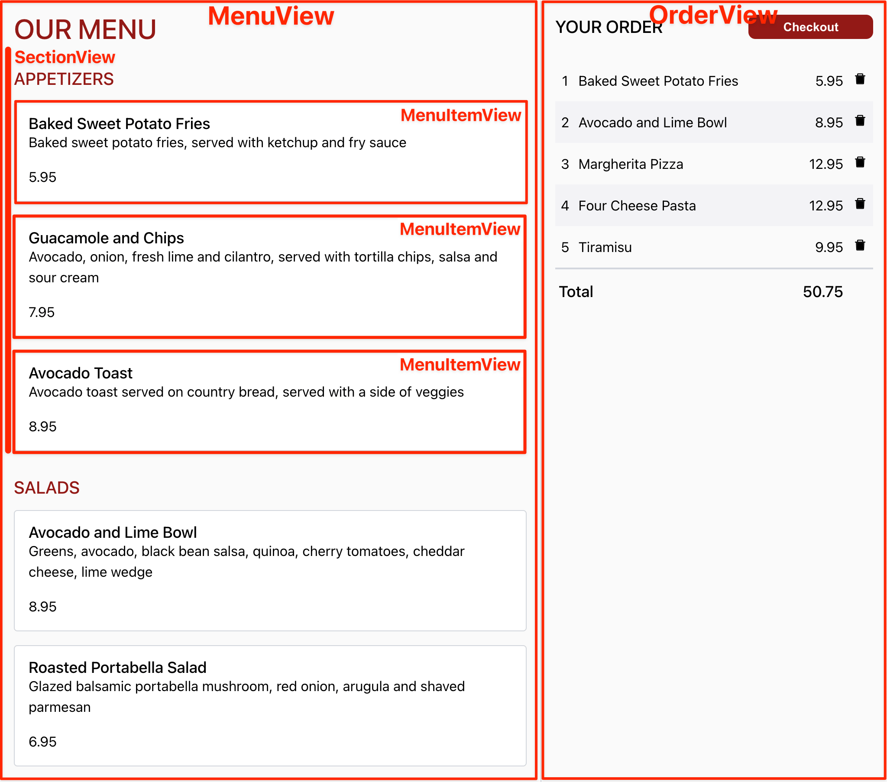

# React Takeout Exercise

A practice exercise to test your React skills. You will be building a takeout
menu from which a user can order food.

If you already know basic HTML, CSS, TypeScript and React, you should be able to
complete this exercise in 4-6 hours. If you don't, I recommend that you to look
at my
[React Learning Resources](https://github.com/nareshbhatia/react-learning-resources)
which include a crash course in these technologies as well as deeper resources
to learn React.

Before you start this exercise, I have one request for you. I believe that we
learn from our mistakes. Realizing what went wrong and reworking the solution
helps us internalize key concepts and not make those mistakes again. So that
others get the opportunity to go through this learning process, I request that
you don't publish your solutions. Use a private repository to work through the
exercise. Thanks for your understanding.

## Screenshots

**Order page with a blank order**

**Order page with a populated order**

## Visual Design

This
[Figma Project](https://www.figma.com/file/I4grGxVxq6em33rCNdHPxs/Takeout?node-id=0%3A1)
contains the visual design for the React Takeout application. You will have to
create an account with Figma to be able to inspect the CSS values.

## Technical Design

Before we jump into implementation, let's create a plan of attack. The diagram
below shows the component breakdown of the `OrderPage`.

We will use the following component hierarchy and folder structure to create
these components.

## Ready, Set, Go!

Now that we have the full context of the exercise, let's jump to implementation.
We will do this in 3 parts:

1. [Set up the basic Order page](parts/part-1-order-page.md)
2. [Implement the Menu view](parts/part-2-menu-view.md)
3. [Implement the Order view](parts/part-3-order-view.md)

Please go to [part 1](parts/part-1-order-page.md) to get started!
